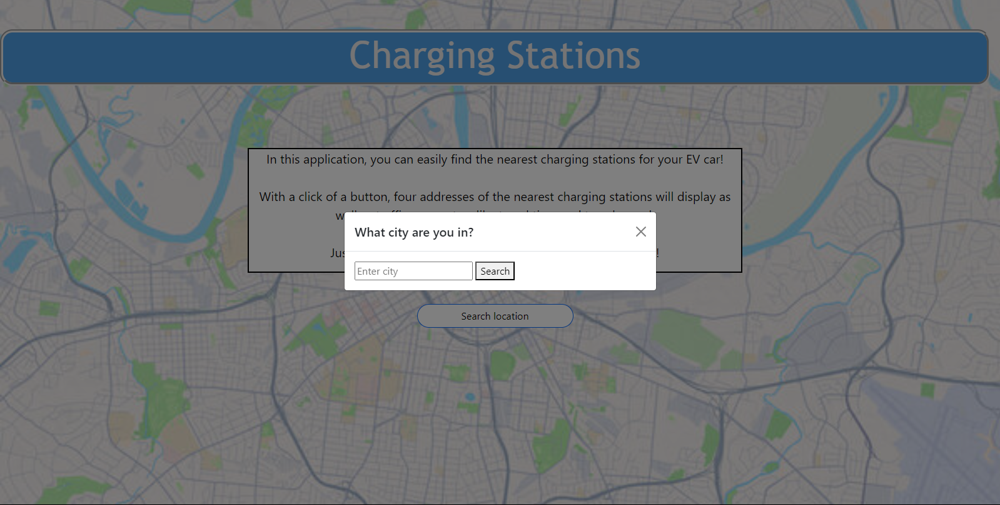
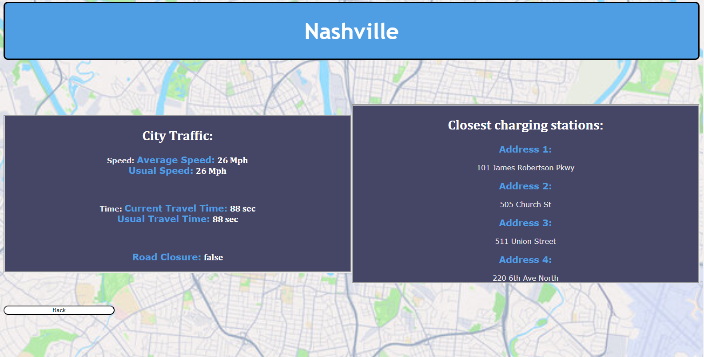

# project-1-charge-car

## Description

The first project from a bootcamp where a group of collaborators needed to come up with a real-world problem that could be solved with code. The problem being solved in this project is a way for electric car owners to quickly find a charging station to charge their car.

## User Story

- AS an electric car owner
- I WANT to find an easy route to a charging station
- SO THAT I can beat traffic and quickly get my car charged

## Acceptance Criteria

GIVEN an application that finds charging stations for your EV car
WHEN I open the application
THEN I am prompted with a screen has a search button and a paragraph detailing the application
WHEN I click on the search button
THEN a modal pops up with an input for city
WHEN I click search on the modal
THEN I am directed to the second page
WHEN I am on the second page
THEN traffic parameters and charging station addresses are displayed
WHEN I click a back button
THEN I am directed back to the first page
WHEN the application is being used on any device
THEN the application is responsive to any screen size

## Process

The process included creating a modal form for the input of a city. Once a city is searched, the next page pops up with the city details. This application includes two pages with each their own html, js, and css files which were all linked together in the html. The process of this application required the fetching of the APIs and the response would store the info into local storage. The data was pulled from storage to be displayed on the screen. A back button was added on the second page to go back to the first page. 

## Links

Link to website used for this challenge.
https://mackemo.github.io/project-1-charge-car/

Link to public Github repository for this challenge.
https://github.com/mackemo/project-1-charge-car

## Technologies Used

OpenCharge API
TomTom

## Usage

This site was a practice project assignment for bootcamp students but can be used to see how a website that includes server-side apis can be created by inspecting the webpage.

## License

N/A

## Contributors

Matthew Thomas, Sean Crocker, Brandon Morrison, Mackenzie Moore

## Acknowledgement

Project was done by the knowledge learned from bootcamp instructor John

